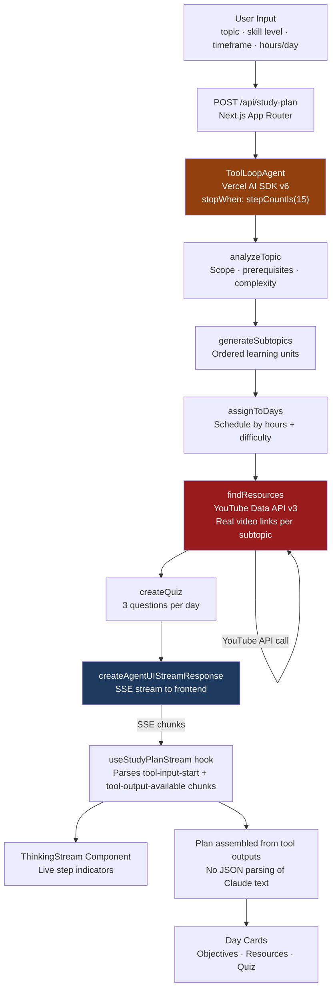

# Smart Study Planner Agent


> An AI agent that builds you a personalized, day-by-day study curriculum and lets you watch it think in real time.

---

## What This Is

Most AI study tools take your topic and return a generic plan in one shot. This is different.

The Smart Study Planner uses a **multi-step AI agent** that reasons through your curriculum the way an expert tutor would by analyzing scope, breaking the topic into ordered subtopics, scheduling them across your available days, finding real YouTube resources, and writing quiz questions for each session. Every decision happens **autonomously**, step by step, and streams to your screen as it happens.

You don't get a response. This is not a Workflow where we code the flow. Agent will decide what to do. You watch an agent work.

```
This is a guided agent, the system prompt establishes a recommended sequence,but Claude autonomously executes it,
adapts to tool outputs, handles failures gracefully,and makes decisions your code never prescribes
(example: it made a parallel tool execution across days when it's not mentioned in the code).
The line between a guided agent and a workflow is whether the model or our code controls the execution path.
Here, the model does.
```

---

## What Makes This Different

### 1. Real-Time Agent Thinking Stream

The right panel shows every reasoning step as it completes not after everything is done. You see the agent analyze your topic, generate subtopics, assign days, fetch YouTube links, and write quizzes, one step at a time with live timing per step.

```
Agent Thinking                              · 17/17 steps done · 12.7s total
✓ Analyzing topic scope and complexity      — "Machine Learning" — foundational complexity
✓ Breaking topic into ordered subtopics     — 7 subtopics generated
✓ Assigning subtopics to daily schedule     — 7 days scheduled
✓ Finding YouTube resources                 — Resources found for "Supervised Learning" (1.2s)
✓ Generating quiz questions                 — 3 questions for "Supervised Learning" (0.8s)
...
```

This is the core experience **seeing AI reason in real time**, not just produce output.


---

### 2. Skill Level Adaptation

The same topic produces genuinely different curricula depending on your level. Here is a real comparison both generated for **Machine Learning, Intermediate, 1 week**:

The regenerated plan starts deeper (Bias-Variance before algorithms), covers SVMs and probabilistic models the first plan skipped, and frames neural networks at the internals level rather than the fundamentals level. Same inputs, meaningfully different curriculum.

First Generation:


After Regenerate:


---

### 3. Real YouTube Resources via API

The `findResources` tool calls the YouTube Data API v3 server-side on every run, returning real, current video links matched to each subtopic and skill level. Resource links are never hallucinated, rather they are live API results embedded directly in each day card.

---

### 4. Export to JSON

Every generated plan exports as a structured JSON file with topics, objectives, resources, and quiz questions ready to be consumed by other tools or stored for later.

---

## Architecture



> **Architecture note:** The plan is assembled entirely from tool output objects streamed back through the SSE protocol not from parsing Claude's final text response. This makes the output deterministic and schema-safe regardless of how Claude formats its prose answer.

---

## How the Agent Loop Works

1. **You submit a topic.** The frontend posts to `/api/study-plan` with your topic, skill level, timeframe, and hours per day.

2. **The agent starts reasoning.** `ToolLoopAgent` gives Claude a set of tools and a system prompt. Claude decides which tool to call first — your code never prescribes the sequence.

3. **Each tool call streams to your screen.** As Claude calls each tool, a `tool-input-start` chunk arrives at the frontend and a new step appears in the thinking panel (amber, spinning). When the tool returns a result, a `tool-output-available` chunk arrives and the step flips to complete (green checkmark) with timing.

4. **Tool outputs build the plan.** Every `findResources` and `createQuiz` result is stored in the hook. When the `finish` chunk arrives, the hook assembles the final plan from those stored results — not from Claude's text.

5. **The thinking panel collapses.** 800ms after the plan arrives, the thinking stream collapses to a summary bar and the day cards take full screen.

---

## Tech Stack

| Technology | Version | Role |
|---|---|---|
| Next.js | 16 (App Router) | Framework + API routes |
| Vercel AI SDK | v6.0.185 | `ToolLoopAgent`, `createAgentUIStreamResponse` |
| `@ai-sdk/anthropic` | 3.0.78 | Claude model provider |
| Claude Sonnet | claude-sonnet-4-6 | Agent reasoning model |
| Zod | 4.4.3 | Tool input schema validation |
| Tailwind CSS | 3 | Styling |
| YouTube Data API v3 | — | Real resource links (free tier) |

---

## Getting Started

### Prerequisites

- Node.js 18+
- An Anthropic API key — [console.anthropic.com](https://console.anthropic.com)
- A YouTube Data API v3 key (free) — see below

### Getting a YouTube API Key (5 minutes, no billing required)

1. Go to [console.cloud.google.com](https://console.cloud.google.com)
2. Create a new project
3. Search **"YouTube Data API v3"** → Enable
4. Go to **Credentials** → **Create Credentials** → **API Key**
5. In the key settings, set **API restrictions** → select **YouTube Data API v3**
6. Copy the key

Free tier gives 10,000 units/day. Each plan generation uses approximately 10 units.

### Installation

```bash
# Clone the repository
git clone https://github.com/YOUR_USERNAME/smart-study-planner.git
cd smart-study-planner

# Install dependencies
npm install

# Create environment file
touch .env.local
```

Add to `.env.local`:

```env
ANTHROPIC_API_KEY=sk-ant-...
YOUTUBE_API_KEY=AIza...
```

```bash
# Start development server
npm run dev
```

Open [localhost:3000](http://localhost:3000).

---

## Example Agent Output

A single day's structured output assembled from tool results:

```json
{
  "day": 1,
  "subtopic": "Supervised Learning & Core Algorithms",
  "hoursAllocated": 2,
  "objectives": [
    "Understand the distinction between supervised and unsupervised learning",
    "Implement linear regression and logistic regression from scratch",
    "Evaluate model performance using accuracy, precision, recall, and F1"
  ],
  "resources": [
    {
      "title": "Supervised Machine Learning: Regression and Classification",
      "url": "https://www.youtube.com/watch?v=...",
      "channel": "Stanford Online"
    },
    {
      "title": "Machine Learning Full Course for Beginners",
      "url": "https://www.youtube.com/watch?v=...",
      "channel": "freeCodeCamp"
    }
  ],
  "quiz": [
    {
      "question": "What is the core difference between classification and regression in supervised learning?",
      "answer": "Classification predicts discrete labels (e.g. spam/not spam); regression predicts continuous values (e.g. house price). Both learn from labeled training data."
    },
    {
      "question": "How would you detect overfitting in a trained model?",
      "answer": "Compare training accuracy vs validation accuracy. A large gap (high train, low validation) indicates overfitting. Use cross-validation, regularization, or more data to address it."
    },
    {
      "question": "What is a common mistake when splitting data for model evaluation?",
      "answer": "Data leakage — preprocessing (scaling, imputation) fitted on the full dataset before splitting, causing the test set to influence training. Always fit preprocessors on training data only."
    }
  ]
}
```

---

## Key Engineering Decisions

**Why assemble the plan from tool outputs instead of parsing Claude's text?**
Claude's final response is rich markdown prose — tables, emojis, code blocks. Parsing that reliably is fragile. Instead, every tool's structured return value is captured as it streams back via `tool-output-available` chunks, and the plan is assembled from those objects at `finish` time. The UI never depends on Claude's text formatting.

**Why `temperature: 0.7` instead of `0`?**
Week 2 used `temperature: 0` for structured output generation — determinism was critical there because any creativity risked breaking the schema. Here, variation is a feature. The same topic at 0.7 produces genuinely different subtopic orderings, different resource queries, and different quiz angles. Regenerate is meaningful because of this.

**Why `stopWhen: stepCountIs(15)`?**
Without a stop condition, a buggy agent prompt could loop indefinitely burning API tokens. `15` gives the agent enough headroom for a 7-day plan (5 tools × 7 days = 35 calls maximum — but Claude batches findResources and createQuiz intelligently) while preventing runaway loops. It's the production equivalent of a request timeout.

**Why is `findResources` the slowest step?**
It makes a live HTTP call to the YouTube Data API per subtopic. In production, this would be cached by `subtopic + skillLevel` key with a 24-hour TTL, reducing repeat plan generation from ~15s to ~3s.

---

## What I Learned

- **ToolLoopAgent vs a single prompt:** A single prompt produces a flat, generic plan. The agent produces an adaptive curriculum because each tool's output informs the next decision. The model is reasoning between steps, not just formatting text.

- **When agents make sense vs workflows:** If the execution path is fixed and known, use a workflow — it's cheaper and more predictable. Use an agent when the model needs to adapt based on intermediate results, handle unexpected tool outputs, or make sequencing decisions your code can't anticipate.

- **Real-time step streaming mechanics:** The Vercel AI SDK v6 SSE protocol emits `tool-input-start`, `tool-input-available`, `tool-output-available`, and `finish` chunks. Listening to `tool-input-start` (not `tool-input-available`) gives the earliest signal to show a step as active, improving perceived responsiveness.

- **Tool design is prompt engineering:** Claude decides which tool to call based on the `description` field alone. A vague description causes wrong sequencing or skipped tools. Precise, action-oriented descriptions ("Break a topic into ordered subtopics from foundational to advanced") produce reliable agent behavior without hardcoding the sequence in code.

- **Defensive output handling:** Even with a system prompt explicitly requesting JSON, Claude returns markdown prose when it reasons that prose is more helpful. Never trust LLM text formatting in production. Capture structured data at the tool boundary where the schema is enforced by Zod.


## License

MIT
